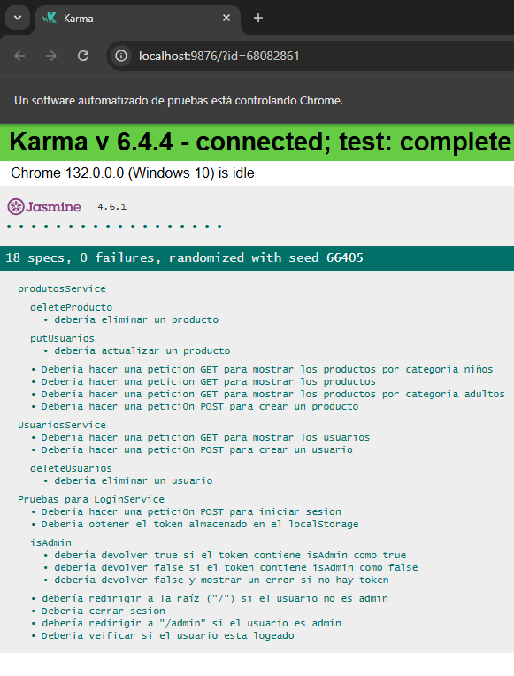

<h1>🏃‍♂️ Ecommerce de Zapatos Deportivos - URBANFOOT 👟</h1>  

¡Bienvenido a [Nombre de tu Empresa], tu tienda en línea de confianza para zapatos deportivos de alta calidad! 🛒👟
En este ecommerce, ofrecemos una experiencia de compra fácil y rápida, con un catálogo diverso de productos pensados para todos los amantes del deporte y el estilo. ¡Corre, salta y entrena con los mejores zapatos!

⚙️<h3> Tecnologías Utilizadas</h3>

Este proyecto está construido con un stack tecnológico moderno para garantizar una experiencia de usuario fluida y un código mantenible:

HTML 🧑‍💻: Estructura básica del sitio web.
CSS 🎨: Diseño visual atractivo y responsive.
Angular 🔥: Framework para crear interfaces de usuario dinámicas y ricas en funcionalidades.
Node.js 🚀: Entorno de backend para manejar las peticiones y lógica del servidor.
MongoDB 🗃️: Base de datos NoSQL para almacenar productos, usuarios y pedidos.
TypeScript ⚡: Mejora la calidad del código con tipado estático.
Postman 🛠️: Herramienta para probar nuestras APIs y asegurarnos de que todo funcione correctamente.

<h3>💡 Características</h3>
 
<h6>Página Principal 🌐</h6>
Vistazo rápido a los productos destacados, categorías y promociones.
Barra de navegación intuitiva: categorías, carrito de compras, contacto.

<h6>Catálogo de Productos 🛍️</h6>
Filtros inteligentes: busca por tamaño, marca, precio y más.
Paginación y búsqueda dinámica para facilitar la navegación.

<h6>Detalles de Producto 📦</h6>
Información completa: descripción, imágenes de alta calidad, tallas y colores.
Agregar al carrito con un solo clic.

<h6>Formularios de registro</h6>
En este componente nos ayudara tanto como para registrarnos como para iniciar sesion.

<h6>Autenticación y Gestión de Usuarios 🔒</h6>
Registro y login de usuarios para compras más rápidas.
Gestión de perfil y visualización de historial de compras.

<h6>Panel de Administración 🛠️</h6>
Administradores pueden agregar, editar y eliminar productos fácilmente.
Visualización y gestión de pedidos.

<h3>Autores</h3>
 

Realizado por Christian Franco y Sebastian Cardona.
 

